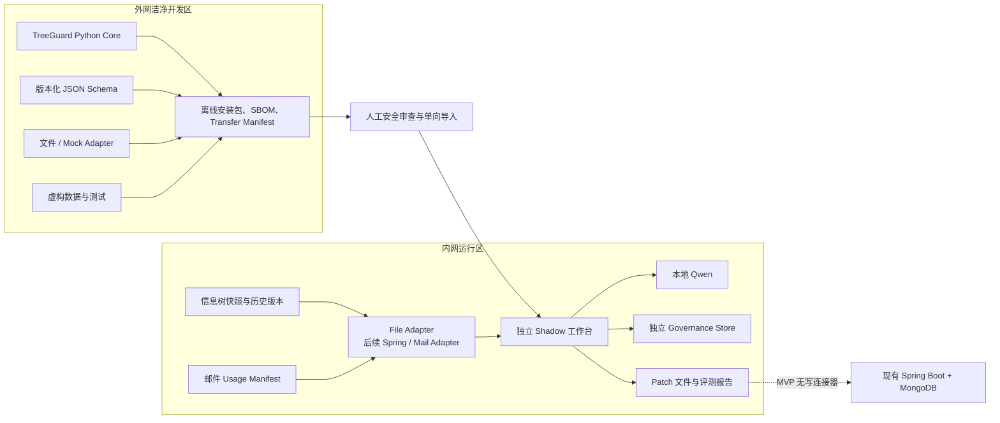

# TreeGuard 技术架构

状态：设计基线
目标：可由外网开发、经安全审查单向导入、在内网独立运行的文件型 Shadow MVP

## 1. 架构约束

- 外网 Codex 无法访问真实内网数据和代码；
- 内网只允许导入经过安全审查的通用源码和依赖；
- 首版不要求修改现有 Spring Boot 或 MongoDB；
- 内网 A10 运行量化 Qwen3.6-35B-A3B-FP8；
- 在线交互可接受约 10–30 秒延迟；
- Qwen 编程和复杂工具调用能力有限；
- 一棵信息树通常约 2,000 个节点，MVP 不需要大型搜索集群；
- 邮件系统保存模板到节点的引用，但信息树侧没有实时反向索引；
- 基础 Schema 是单父树，不原生支持继承或多父引用。

## 2. 双区架构



外网建设通用能力，内网薄 Adapter 负责把真实导出格式转换为标准合同。通用 Core 不包含内部 DTO、数据库凭证、真实 Prompt、真实节点或业务规则。

## 3. 部署形态

MVP 使用 Python 模块化单体，而不是微服务：

```text
tree_import
history
retrieval
workflow
llm_gateway
overlay
deliberation
patch
usage_registry
trace_replay
evaluation
```

建议运行形态：

- FastAPI：本地 API 和工作台后端；
- 简单 Web UI：意图卡、候选比较、讨论、Patch 和 Shadow 评测；
- 内嵌或独立 MongoDB：保存 Overlay、讨论、Trace 和评测元数据；
- 文件系统：导入快照、Usage Manifest、导出 Patch 和报告；
- 本地模型 Provider：适配内网 Qwen 接口；
- BM25 + 向量索引：约 2,000 节点的全树检索。

MVP 不引入 Elasticsearch、图数据库、Kafka 或多微服务编排。

## 4. 版本化合同

所有跨模块和跨区合同都应有独立 JSON Schema 版本，不能只依赖 Pydantic 类。

### 4.1 `TreeSnapshot`

核心字段：

```text
schema_version
source_map_type
is_resource_map
tree_id
tree_version
version_record_id
source_revision
snapshot_hash
nodes[]
```

节点至少包含：

```text
node_id
parent_node_id
node_kind
name
value_type
cardinality
order
node_hash
```

真实系统的额外字段由内网 Adapter 显式映射。未知关键字段必须 fail-closed。

`is_resource_map` 由 `source_map_type` 计算，只描述来源事实，不是 Patch 授权。正式 Patch 编译必须重新检查 source type、结构合同、版本记录、revision 和 snapshot hash。

### 4.2 `TreeDiff`

以 `node_id` 比较两个 CanonicalTree 快照，区分同一业务版本的保存修订和跨业务版本比较。Diff 使用确定性代码，忽略 VALUE、审计字段和派生路径，不从名称或 route 猜测节点对应关系。

### 4.3 `ChangeIntent`

包含原始需求、主体、角色、场景、生命周期、属性归属、类型、基数、拟挂载位置、事实、假设和证据缺口。

### 4.4 `SemanticOverlay`

至少包含：

```text
overlay_id
node_id
base_tree_version
base_node_hash
definition
applicability
exclusions
aliases
relations[]
status
provenance
```

状态：

```text
AI_DRAFT
EXPERT_APPROVED
REJECTED
STALE
```

只有 `EXPERT_APPROVED` 的补充语义可以进入在线判断。基础节点修改后，如果 `base_node_hash` 不再匹配，Overlay 自动变为 `STALE`。

### 4.5 `DeliberationRecord`

包含专家原文、事实、假设、风险、未决问题、证据、修订历史和审批状态。

### 4.6 `SchemaPatch`

至少包含：

```text
patch_id
idempotency_key
base_tree_version
base_snapshot_hash
intent_run_id
operations[]
preconditions[]
validation
impact
status
```

MVP Patch 是声明式文件，不包含数据库连接和执行代码。

### 4.7 `UsageManifest`

至少包含：

```text
consumer_type
consumer_id
consumer_version
tree_id
tree_version
node_refs[]
status
observed_at
manifest_hash
```

邮件系统保持引用关系的事实来源。TreeGuard 周期性导入 Manifest，建立只读反向索引。

### 4.8 `WorkflowTrace`

至少记录：

```text
run_id
step_id
workflow_version
tree_version
overlay_version
index_version
prompt_version
model_version
input_hashes
candidate_ids_and_scores
validated_model_output
human_action
human_elapsed_time
```

Trace 中的真实业务文本仅保存在内网，并按权限和保留期限管理。

## 5. 受约束工作流

固定状态机：

```text
CREATED
→ INTENT_DRAFTED
→ INTENT_CONFIRMED
→ CANDIDATES_READY
→ RECOMMENDATION_READY
→ PATCH_DRAFTED
→ STRUCTURE_VALIDATED
→ IMPACT_ASSESSED
→ BUILDER_APPROVED
→ SHADOW_FROZEN
→ HUMAN_DECISION_RECORDED
→ EVALUATED
```

分支状态：

```text
NEED_CLARIFICATION → INTENT_DRAFTED
DELIBERATING
NEED_EVIDENCE
ABSTAIN
STALE
REJECTED
```

约束：

- 每个步骤只能调用白名单能力；
- LLM 只能引用检索工具返回的候选 ID；
- 在线最多两次顺序模型调用；
- 每次模型输出必须通过 JSON Schema 校验；
- 超时、非法 JSON、未知 ID、索引异常或版本漂移均 fail-closed；
- 任何基础树、Overlay、索引或 Usage Manifest 版本变化都使未审批建议进入 `STALE`；
- 未审批结果无法晋升为 Patch。

## 6. 检索与语义决策

### 6.1 宽召回

并行召回通道：

- 节点名称和别名的词法检索；
- 路径、祖先和局部作用域信号；
- 已审批 Overlay 的语义向量；
- 子节点结构、字段类型和基数；
- Semantic Overlay 关系；
- 经专家确认的历史案例。

各通道合并约 20–40 个候选。用户选择的父节点提供 boost，但不裁剪全树候选。

### 6.2 局部精排

使用轻量模型或确定性特征将候选缩小到 5–8 个，再交给 Qwen 比较。输入必须包含候选的完整路径、主体、角色、场景、类型、基数、Overlay 和已知依赖。

### 6.3 分层评测

分别测量：

1. 召回是否找到了正确候选；
2. 精排是否把候选放进 Top-5；
3. 语义决策是否选择了正确动作；
4. 风险门是否在证据不足时正确拒答。

不能用最终准确率掩盖检索漏召回。

## 7. Semantic Overlay

Overlay 是独立于基础树的治理层，以 `node_id + base_tree_version + base_node_hash` 锚定。

可保存：

- 标准定义；
- 适用范围和排除范围；
- 别名；
- 主体、角色、生命周期；
- 语义合同；
- `SAME_AS`；
- `SPECIALIZES`；
- `DISTINCT_FROM`；
- `REUSES_CONTRACT`；
- `OVERLAPS_WITH`。

Overlay 不改变现有 Spring Boot 的运行时语义。`SPECIALIZES` 等关系只是治理元数据，Patch 编译器仍需生成现有 `CONCEPT/PROPERTY` 模型能够表达的普通物理节点。

## 8. Patch 编译与安全

Patch 只允许：

- 直接使用已有节点的无结构变更建议；
- 新增普通节点；
- 基于已审批合同新增物理节点；
- 增加上下文字段；
- 更新 Overlay 草稿；
- 拒答。

确定性门禁顺序：

1. 冻结基础树、Overlay、索引和 Usage Manifest 版本；
2. 校验输入和模型结构化输出；
3. 校验所有候选 `node_id` 来自本次工具结果；
4. 校验动作属于允许集合；
5. 执行节点类型、父子关系、基数和命名规则校验；
6. 执行 Dry Run；
7. 生成影响报告；
8. 检查版本和哈希是否过期；
9. 获取领域专家和建设人员双角色确认；
10. 导出 Patch 文件。

“没有检索到候选”不能直接推导出“可以新增”。当检索索引不健康或召回信号不足时，只能转人工复核。

## 9. 回放模型

事件采用 append-only Trace：

- 原始输入不覆盖；
- AI 输出不覆盖；
- 人工修订以新事件保存；
- 每一步保留对应版本；
- Patch 可以从已保存事件重新构建。

两种回放必须区分：

- **确定性 Trace 回放**：复用历史模型输出，验证后续编译和门禁；
- **模型对照重跑**：冻结输入和候选，替换 Prompt 或模型，用于比较质量。

## 10. 集成演进

阶段 1：文件型 Shadow

- Spring/Mongo 导出树快照；
- 邮件侧导出 Usage Manifest；
- TreeGuard 内网独立运行；
- 输出 Patch 文件和报告；
- 无正式写连接器。

阶段 2：只读 Adapter

- Spring 提供版本化只读导出；
- 邮件侧提供稳定 Manifest；
- 自动检测快照和依赖索引过期。

阶段 3：待审批 Patch

- Spring 接收声明式 Patch；
- Spring 仍负责权限、幂等、版本验证和发布；
- TreeGuard 永远不直接写 MongoDB。

阶段 4：受控发布

- 只有经过充分 Shadow 验证和安全评审后才考虑；
- 删除、移动、合并和改类型仍需要单独迁移机制。
