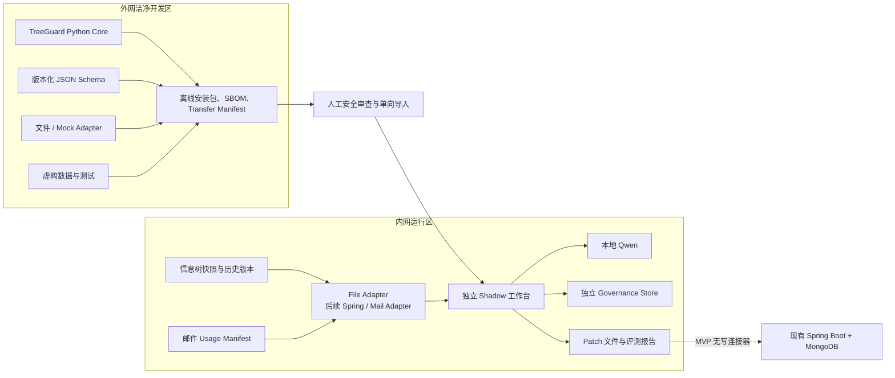

# TreeGuard 技术架构

状态：设计基线
目标：可由外网开发、经安全审查单向导入、在内网独立运行的文件型 Shadow MVP

## 1. 架构约束

- 外网 Codex 无法访问真实内网数据和代码；
- 内网只允许导入经过安全审查的通用源码和依赖；
- 首版不要求修改现有 Spring Boot 或 MongoDB；
- 内网 A10 运行量化 Qwen3.6-35B-A3B-FP8；
- 在线交互可接受约 10–30 秒延迟；
- Qwen 编程和复杂工具调用能力有限；
- 一棵信息树通常约 2,000 个节点，MVP 不需要大型搜索集群；
- 邮件系统保存模板到节点的引用，但信息树侧没有实时反向索引；
- 基础 Schema 是单父树，不原生支持继承或多父引用。

## 2. 双区架构



外网建设通用能力，内网薄 Adapter 负责把真实导出格式转换为标准合同。通用 Core 不包含内部 DTO、数据库凭证、真实 Prompt、真实节点或业务规则。

## 3. 部署形态

MVP 使用 Python 模块化单体，而不是微服务：

```text
tree_import
history
retrieval
workflow
llm_gateway
overlay
deliberation
patch
usage_registry
trace_replay
evaluation
```

建议运行形态：

- FastAPI：本地 API 和工作台后端；
- 简单 Web UI：意图卡、候选比较、讨论、Patch 和 Shadow 评测；
- 内嵌或独立 MongoDB：保存 Overlay、讨论、Trace 和评测元数据；
- 文件系统：导入快照、Usage Manifest、导出 Patch 和报告；
- 本地模型 Provider：适配内网 Qwen 接口；
- BM25 + 向量索引：约 2,000 节点的全树检索。

MVP 不引入 Elasticsearch、图数据库、Kafka 或多微服务编排。

### 3.1 已实现的工作台与治理纵切

当前已经实现只读浏览和第一个治理交互纵切：

```text
React + Ant Design Tree
  → Vite development proxy
  → loopback FastAPI Workbench API
      ├→ WorkbenchService 正向允许列表
      │   → ProvisionalRepositoryClient
      │   → Clean-room Simulator
      │   → CanonicalTree
      └→ WorkbenchGovernanceService
          → Intent / Retrieval / Semantic Core
          → loopback Simulator 或显式批准的百炼 Provider
          → private sidecar
```

FastAPI 的目录接口只提供分类、资源、版本和树视图读取。树视图用一次性
`N000001` 形式引用替换稳定节点 ID，只包含名称、label、kind、类型、基数、顺序、
子引用和派生名称面包屑；不返回 VALUE、未知 metadata、extension、source route、
哈希或文件路径。独立治理接口提供受约束的 case/operation 状态。浏览器不直连
仓库或模型，API 关闭访问日志并对响应设置 `no-store`。

治理 API 使用进程内 operation registry 承载模型调用；浏览器只持有随机
`case_ref`、`operation_ref`、树视图 `N000001` 和候选 `C001`—`C008` 引用。
服务端重新读取指定快照，复用既有意图、单轮澄清、候选召回、语义建议和人工复核
状态机，并把正式工件不可覆盖地写入私有 case 目录。人工接受或拒绝后仍固定为
运营反馈，`semantic_approval=false`、`gold_eligible=false`、
`patch_eligible=false`。

当前没有跨进程 case 恢复、数据库、认证、多 worker 队列或生产写能力。该纵切只
证明 2,001 节点虚构树上的浏览、AI 建议、人工复核与可回放旁路可以端到端运行。

## 4. 版本化合同

所有跨模块和跨区合同都应有独立 JSON Schema 版本，不能只依赖 Pydantic 类。

### 4.1 `TreeSnapshot`

核心字段：

```text
schema_version
source_map_type
is_resource_map
tree_id
tree_version
version_record_id
source_revision
snapshot_hash
nodes[]
```

节点至少包含：

```text
node_id
parent_node_id
node_kind
name
value_type
cardinality
order
node_hash
```

真实系统的额外字段由内网 Adapter 显式映射。未知关键字段必须 fail-closed。

`is_resource_map` 由 `source_map_type` 计算，只描述来源事实，不是 Patch 授权。正式 Patch 编译必须重新检查 source type、结构合同、版本记录、revision 和 snapshot hash。

### 4.2 `TreeDiff`

以 `node_id` 比较两个 CanonicalTree 快照，区分同一业务版本的保存修订和跨业务版本比较。Diff 使用确定性代码，忽略 VALUE、审计字段和派生路径，不从名称或 route 猜测节点对应关系。

### 4.3 `HistoryReview`

对同一业务版本内的正向 `resource` 保存修订做确定性证据整理，包含：

```text
knowledge_status
source_diff_hash
scope
base
target
revision_gap
interval_completeness
reconstructs_historical_operations
review_cases[]
informational_observations[]
summary
run_hash
```

一般变化只按已变化节点之间的直接父子关系形成 `STRUCTURAL_CANDIDATE`；移动节点不桥接旧、新父域，纯顺序变化只进入信息观察。风险等级和可执行门禁分轴表示：`HIGH_RISK` 不必然等于 `BLOCKED`，`UNKNOWN` 表示仍缺权威事实。修订缺口把候选门禁提升到至少 `UNKNOWN`，但不会把已有的 `BLOCKED` 降级。VALUE 门禁同时记录节点直接外层和上层 `class` 复合外层的观察证据。任何候选都只是 `EVIDENCE_ONLY`，不能直接当作历史意图或 Gold。

完整 HistoryReview 含节点引用，只能留在内网。跨网只能使用不含 ID、路径和哈希的固定码聚合报告。

JSON Schema、运行时不变量和无密钥哈希只验证制品内部自洽，不能证明每个节点变化确实来自某个 TreeDiff。跨进程读取完整制品时必须调用可信快照重放校验，重新执行 `mine_history_pair` 并逐字段比对；不能只校验 `run_hash`。

### 4.4 `BusinessVersionReview`

首期只比较 `version-info` 能稳定提供的相邻业务版本。当前版本先后仅由调用方显式
声明并标记为 `UNVERIFIED_EXPLICIT_SEQUENCE`，不解析 `version` 字符串，也不要求
两个版本的 `source_revision` 连续。
结果只表示发布端点之间的 `ENDPOINT_NET_CHANGE`，不能声称恢复了发布中的操作顺序、
修改原因或专家意图。

它复用 HistoryReview 的确定性结构分簇、VALUE 风险门和信息观察，但使用独立顶层
合同。完整制品必须通过可信快照重放校验；显式版本顺序的真实性还需要未来由
`version-info` 清单或签名导入清单提供来源证据。

### 4.5 `LLMEvidencePack` 与 `AIReviewDraft`

业务版本审查产生的一个 ReviewCase 经白名单投影后才可进入模型：

- 只保留节点 kind、label、name、派生路径、类型、基数和是否存在 constraints；
- 原始 VALUE、未知 metadata、extension、审计字段和真实 `node_id` 不进入模型；
- 使用一次性 `F/X/C` 引用表示焦点、上下文和候选，映射只存在于明确的内部制品；
- 内部 run/case/pack 哈希和业务版本标识不进入外部模型请求，避免形成稳定跨请求指纹；
- 默认最多 5 个词法候选，序列化输入上限 48,000 字符，超限直接失败；
- 模型只能提交观察、假设、候选关系、放置疑问、专家问题和不确定性，不能生成 Patch。

百炼开发 Provider 使用 `qwen3.6-35b-a3b` 的 OpenAI 兼容 JSON Mode，并关闭思考
模式。Provider 能力只能标记为 `JSON_OBJECT`：原始
`ai-review-model-output.v1` 仍需由本地代码逐字段校验，然后由本地绑定
`case_id + source_pack_hash` 生成可信来源明确的 `ai-review-draft.v1`；失败最多重试
一次后 `ABSTAIN`。只接受 `finish_reason=stop` 的完整响应；确定性跨字段政策禁止
`BLOCKED` 案例获得接受性建议，也禁止缺少候选评估时宣称重复或复用。专家审查合同
与 AI 草稿分离，专家可以提交自由文本思路和不确定性，不会被强迫归入单一 N 分类。

外部百炼只允许完全虚构或获批脱敏样本。真实 EvidencePack 和 AIReviewDraft 仍是
内网敏感制品；内网 Qwen 复用相同合同但使用独立 Provider。

### 4.6 `ChangeIntent`

当前文件型实现把它拆成七个边界：

1. `IntentRequest v1` 保存原始需求、拟挂载节点和类型/基数提示；
2. 模型只返回主体、角色、场景、生命周期、属性归属、类型、基数、事实、假设、
   证据缺口和至多一个追问，禁止 ID、审批、动作和 Patch；
3. `ChangeIntentDraft v1` 由本地代码绑定需求哈希、基础快照和模型来源声明；
4. `IntentClarificationAnswer v1` 以初始草稿哈希绑定一次用户自由文本回答；
5. `IntentClarificationRound v1` 使用不含稳定 ID、最大 48,000 字符的允许列表投影，
   把原需求、初始意图、唯一问题和回答交给模型，并绑定修订后的完整意图；
6. 初始草稿为 `NEEDS_CLARIFICATION` 时禁止直接确认；MVP 最多澄清一轮，修订意图
   仍有问题时固定为 `CLARIFICATION_LIMIT_REACHED`，不得进入检索；
7. `IntentConfirmation v1` 由独立 action 绑定实际查看的初始草稿或澄清轮次，只能进入检索，
   固定 `semantic_approval=false`、`patch_eligible=false`。

草稿、回答、澄清轮次、action 和确认均为私有 sidecar。读取时从需求、快照、
内嵌初始草稿、回答、当前意图来源和 action 重放，不能只信任外层哈希。每轮只问
一个问题与“整个产品永远只问一次”是不同边界；多轮能力需要后续新合同。直接路径
最多发生两段顺序模型调用，单轮澄清路径最多三段。文件声明的 reviewer/answerer
身份仍为
`UNVERIFIED_FILE_ASSERTION`。

### 4.7 `SemanticRecommendationDraft` 与 `RecommendationRecord`

当前文件型实现从可信 `CandidateSet` 固定投影 Top-8，并使用一次性
`C001`—`C008` 引用交给模型。模型视图保留候选名称、label、路径、节点类型、
值类型、基数和检索原因，但排除稳定节点 ID、快照/候选哈希、原始 VALUE 和未知
字段。规范 JSON 总长限制为 48,000 字符；超限直接拒绝，不依赖模型截断。
投影及其哈希由本地代码从确认意图、Top-20 候选和当前快照重算。

模型必须按投影顺序完整评估每个候选，关系仅允许：

```text
SEMANTICALLY_EQUIVALENT
REUSES_CONTRACT
CONTEXTUALLY_RELATED
NOT_EQUIVALENT
NEED_EVIDENCE
```

一次调用只产生一个选择性动作：

```text
USE_EXISTING_NODE
ADD_NODE_FROM_CONTRACT
ADD_CONTEXT_FIELD
NEED_CLARIFICATION
NEED_EVIDENCE
ABSTAIN
```

前三个正向动作必须选择候选，且候选关系分别为
`SEMANTICALLY_EQUIVALENT`、`REUSES_CONTRACT`、`CONTEXTUALLY_RELATED`。
`ADD_CONTEXT_FIELD` 在 Shadow MVP 中还要求确认意图含非空场景和至少一项
`confirmed_facts`；这是待内网效果验证的临时证据下限，不是长期领域真理。
澄清动作必须且只能携带一个问题；证据动作必须列出证据缺口；零候选、全为
`NEED_EVIDENCE` 或来源漂移时不能产生正向动作。

`SemanticRecommendationDraft v1` 绑定确认、候选集、快照、投影及模型来源。人工
通过独立 `RecommendationReviewAction v1` 确认、按相同本地政策修订或拒绝。
`RecommendationRecord v1` 从全部可信来源重放产生，固定：

```text
record_semantics=OPERATIONAL_FEEDBACK_ONLY
identity_status=UNVERIFIED_FILE_ASSERTION
semantic_approval=false
patch_eligible=false
gold_eligible=false
```

因此“人工确认模型建议”只形成可追溯的运营反馈，不等于领域语义审批、评测 Gold
或可执行 Patch。完整 reasoning 留在内网私有 sidecar，聚合回放不输出文本、引用、
节点信息或哈希。

### 4.8 `SemanticOverlay`

至少包含：

```text
overlay_id
node_id
base_tree_version
base_node_hash
definition
applicability
exclusions
aliases
relations[]
status
provenance
```

状态：

```text
AI_DRAFT
EXPERT_APPROVED
REJECTED
STALE
```

只有 `EXPERT_APPROVED` 的补充语义可以进入在线判断。基础节点修改后，如果 `base_node_hash` 不再匹配，Overlay 自动变为 `STALE`。

### 4.9 `DeliberationRecord`

当前落地合同名为 `ExpertReviewSession v1`，是单案例、文件型、追加式事件账本，
不实现聊天系统、Web、数据库或 Patch。会话在创建时绑定：

- `case_id`；
- `source_pack_hash`；
- `source_ai_draft_hash`；
- 固定工作流版本和 `ASSISTED` 评审模式。

文件实现同时记录 `actor_identity_status=UNVERIFIED_FILE_ASSERTION` 和
`initial_ai_provenance_status=UNVERIFIED_FILE_BUNDLE`。它们表示来源已被哈希绑定，
但 actor 身份、审批人身份以及初始 AI 调用来源尚未经过服务端认证。

来源共同生成 `genesis_hash`，首事件的 `previous_event_hash` 必须指向它，避免把完整
事件链移植到另一案例。后续事件按连续序号和前序哈希相连，会话状态与 head hash
全部由 reducer 重放得到。无密钥 SHA-256 只能发现普通删改、重排和来源漂移，不是
数字签名；跨进程可信仍依赖内网 ACL，后续可增加 MAC、签名或 WORM 存储。

事件固定为：

1. `EXPERT_THOUGHT_SUBMITTED`：领域专家或信息树建设人员提交逐字原文，系统确定性
   分配 `Txxx` 引用；
2. `AI_SYNTHESIS_RECORDED`：保存不可信 AI 整理草稿，只能包含专家主张、假设、
   不确定性、风险、证据请求和追问，每个条目至少引用一个本次获准的 `Txxx`；
3. `EXPERT_STATUS_RECORDED`：只有领域专家可以进入 `NEED_EVIDENCE` 或
   `PROVISIONAL`；
4. `EXPERT_FINAL_DECISION_RECORDED`：只有领域专家能从 `PROVISIONAL` 进入
   `APPROVED` 或 `REJECTED`，并必须绑定提交前的 `expected_session_hash`。

AI 事件永远不改变权威状态，也不能包含 state、approval、final decision 或 Patch。
专家在 `PROVISIONAL` 后新增思考会回到 `DELIBERATING`。终态拒绝任何追加；纠错应
创建新会话，正式 supersession 留到后续版本。为保持上下文和调用预算有界，v1
每个会话最多记录一次 AI 整理；整理后的新增思考由人工继续裁决，或进入新会话。

外部百炼整理采用两阶段清单。`prepare-approval` 在不联网的情况下，根据冻结
EvidencePack、初审草稿、逐字专家原文、端点、模型、Prompt 和最多两次请求体生成
精确请求计划哈希及 `PENDING` 私有清单。审批人另存 `APPROVED` 清单后，
Provider 在联网前重算哈希；会话回放也重算同一哈希，并要求审批时间不晚于 AI
事件时间。该机制能验证“文件中声明的审批覆盖了请求计划及其全部字段”，但因为
审批身份仍是 `UNVERIFIED_FILE_ASSERTION`，不能证明是谁批准，也不是数字签名。

`treeguard-expert-review apply` 每次只追加一个专家动作并独占创建新的 `0600`
会话文件；所有树、bundle、action、上一会话和审批清单输入也必须不宽于 `0600`。
`replay` 只重算来源、审批请求计划、事件链和状态，绝不联网。标准输出只含固定枚举
和计数，不含原文、actor、引用、路径、版本或哈希。当前任何状态都不直接生成
Patch；`APPROVED` 只代表领域语义裁决完成，仍然
`patch_eligible=false`、`gold_eligible=false`。

文件模式没有持久化的权威 HEAD、原子 compare-and-swap 或全局 action registry。
因此两个进程可以从同一会话文件生成两个分别通过回放的后继分支；聚合报告固定显示
`authoritative_head_status=NOT_AVAILABLE_FILE_MODE`。未来接入仓库或数据库时必须
由受控服务选择 head、拒绝陈旧提交并记录 supersession。在此之前，“完整性有效”
不能解释成“该分支已被选为权威结果”。

### 4.10 `SchemaPatch`

至少包含：

```text
patch_id
idempotency_key
base_tree_version
base_snapshot_hash
intent_run_id
operations[]
preconditions[]
validation
impact
status
```

MVP Patch 是声明式文件，不包含数据库连接和执行代码。

### 4.11 `UsageManifest`

至少包含：

```text
consumer_type
consumer_id
consumer_version
tree_id
tree_version
node_refs[]
status
observed_at
manifest_hash
```

邮件系统保持引用关系的事实来源。TreeGuard 周期性导入 Manifest，建立只读反向索引。

### 4.12 `WorkflowTrace`

至少记录：

```text
run_id
step_id
workflow_version
tree_version
overlay_version
index_version
prompt_version
model_version
input_hashes
candidate_ids_and_scores
validated_model_output
human_action
human_elapsed_time
```

Trace 中的真实业务文本仅保存在内网，并按权限和保留期限管理。

## 5. 受约束工作流

固定状态机：

```text
CREATED
→ INTENT_DRAFTED
→ INTENT_CONFIRMED
→ CANDIDATES_READY
→ RECOMMENDATION_READY
→ PATCH_DRAFTED
→ STRUCTURE_VALIDATED
→ IMPACT_ASSESSED
→ BUILDER_APPROVED
→ SHADOW_FROZEN
→ HUMAN_DECISION_RECORDED
→ EVALUATED
```

分支状态：

```text
NEED_CLARIFICATION → INTENT_DRAFTED
DELIBERATING
NEED_EVIDENCE
ABSTAIN
STALE
REJECTED
```

约束：

- 每个步骤只能调用白名单能力；
- LLM 只能引用检索工具返回的候选 ID；
- 无澄清路径最多两次、单轮澄清路径最多三次顺序模型调用；
- 每次模型输出必须通过 JSON Schema 校验；
- 超时、非法 JSON、未知 ID、索引异常或版本漂移均 fail-closed；
- 任何基础树、Overlay、索引或 Usage Manifest 版本变化都使未审批建议进入 `STALE`；
- 未审批结果无法晋升为 Patch。

## 6. 检索与语义决策

### 6.1 宽召回

当前已实现无 embedding 的第一层确定性基线：对确认意图的主体、角色、场景、
生命周期、值类型、事实和假设做词法分解，并结合名称覆盖、路径、节点类型、值类型、
基数和拟挂载位置生成 Top-20。拟挂载位置只提供 boost；所有合格节点仍参与全树
排序。结果绑定确认哈希和快照哈希，可从可信来源重放。零候选或信号不足固定
`allows_addition=false`，不能推出“应该新增”。

后续目标的并行混合召回通道包括：

- 节点名称和别名的词法检索；
- 路径、祖先和局部作用域信号；
- 已审批 Overlay 的语义向量；
- 子节点结构、字段类型和基数；
- Semantic Overlay 关系；
- 经专家确认的历史案例。

各通道合并约 20–40 个候选。用户选择的父节点提供 boost，但不裁剪全树候选。

### 6.2 局部精排

当前实现先使用确定性召回分数取得 Top-20，再固定投影其中 Top-8 交给 Qwen
逐项比较；尚未实现独立的学习型 reranker。模型只能使用临时候选引用，必须评估
全部投影候选并输出一个受本地关系—动作政策约束的建议。模型输出通过本地精确
字段、枚举、引用、顺序、来源和跨字段校验后，才生成
`SemanticRecommendationDraft`。

后续是否增加 embedding 或学习型 reranker，必须由内网冻结案例证明它改善候选
覆盖或排序，且不能破坏 Top-20 来源绑定、临时引用和确定性回放。

### 6.3 分层评测

以下只是待推敲的评测问题分类，不是当前数据合同、Gold 生成规则或已实现指标：

1. 召回是否找到了正确候选；
2. 精排是否把候选放进 Top-5；
3. 语义决策是否选择了正确动作；
4. 风险门是否在证据不足时正确拒答。

不能用最终准确率掩盖检索漏召回；但在 2,000+ 节点上没有穷举 Gold 时，也不能把
候选池命中率误称为全树召回率。评测合同、样本量、双人复核和专家补充漏召回的
处理方式，需要在后续独立任务中结合模拟树与内网试点重新确定。

## 7. Semantic Overlay

Overlay 是独立于基础树的治理层，以 `node_id + base_tree_version + base_node_hash` 锚定。

可保存：

- 标准定义；
- 适用范围和排除范围；
- 别名；
- 主体、角色、生命周期；
- 语义合同；
- `SAME_AS`；
- `SPECIALIZES`；
- `DISTINCT_FROM`；
- `REUSES_CONTRACT`；
- `OVERLAPS_WITH`。

Overlay 不改变现有 Spring Boot 的运行时语义。`SPECIALIZES` 等关系只是治理元数据，Patch 编译器仍需生成现有 `CONCEPT/PROPERTY` 模型能够表达的普通物理节点。

## 8. Patch 编译与安全

Patch 只允许：

- 直接使用已有节点的无结构变更建议；
- 新增普通节点；
- 基于已审批合同新增物理节点；
- 增加上下文字段；
- 更新 Overlay 草稿；
- 拒答。

确定性门禁顺序：

1. 冻结基础树、Overlay、索引和 Usage Manifest 版本；
2. 校验输入和模型结构化输出；
3. 校验所有候选 `node_id` 来自本次工具结果；
4. 校验动作属于允许集合；
5. 执行节点类型、父子关系、基数和命名规则校验；
6. 执行 Dry Run；
7. 生成影响报告；
8. 检查版本和哈希是否过期；
9. 获取领域专家和建设人员双角色确认；
10. 导出 Patch 文件。

“没有检索到候选”不能直接推导出“可以新增”。当检索索引不健康或召回信号不足时，只能转人工复核。

## 9. 回放模型

事件采用 append-only Trace：

- 原始输入不覆盖；
- AI 输出不覆盖；
- 人工修订以新事件保存；
- 每一步保留对应版本；
- Patch 可以从已保存事件重新构建。

两种回放必须区分：

- **确定性 Trace 回放**：复用历史模型输出，验证后续编译和门禁；
- **模型对照重跑**：冻结输入和候选，替换 Prompt 或模型，用于比较质量。

## 10. 集成演进

阶段 1：文件型 Shadow

- Spring/Mongo 导出树快照；
- 邮件侧导出 Usage Manifest；
- TreeGuard 内网独立运行；
- 输出 Patch 文件和报告；
- 无正式写连接器。

阶段 2：只读 Adapter

- Spring 提供版本化只读导出；
- 邮件侧提供稳定 Manifest；
- 自动检测快照和依赖索引过期。

阶段 3：待审批 Patch

- Spring 接收声明式 Patch；
- Spring 仍负责权限、幂等、版本验证和发布；
- TreeGuard 永远不直接写 MongoDB。

阶段 4：受控发布

- 只有经过充分 Shadow 验证和安全评审后才考虑；
- 删除、移动、合并、改类型和改基数仍需要单独迁移机制。
